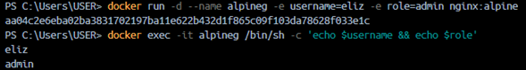
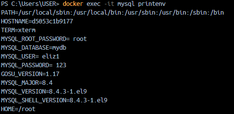

# Variables de Entorno
### ¿Qué son las variables de entorno
Son valores dinámicos que se utilizan para almacenar configuraciones y que pueden afectar el comportamiento de los procesos en ejecución en un ordenador.

### Para crear un contenedor con variables de entorno?
```
docker run -d --name <nombre contenedor> -e <nombre variable1>=<valor1> -e <nombre variable2>=<valor2>
```

### Crear un contenedor a partir de la imagen de nginx:alpine con las siguientes variables de entorno: username y role. Para la variable de entorno rol asignar el valor admin.
```
docker run -d --name alpin -e username=eliz -e role=admin nginx:alpine
```


### Crear un contenedor con mysql:8 , mapear todos los puertos
```
docker run -d --name mysql-container -e MYSQL_ROOT_PASSWORD=root -e MYSQL_DATABASE=mydb -p 3306:3306 mysql:8
```

### ¿El contenedor se está ejecutando?
```
docker ps
```


### Identificar el problema
```
docker logs mysq1
```

### Eliminar el contenedor creado con mysql:8 
```
docker rm mysq1
```

### Para crear un contenedor con variables de entorno especificadas
- Portabilidad: Las aplicaciones se vuelven más portátiles y pueden ser desplegadas en diferentes entornos (desarrollo, pruebas, producción) simplemente cambiando el archivo de variables de entorno.
- Centralización: Todas las configuraciones importantes se centralizan en un solo lugar, lo que facilita la gestión y auditoría de las configuraciones.
- Consistencia: Asegura que todos los miembros del equipo de desarrollo o los entornos de despliegue utilicen las mismas configuraciones.
- Evitar Exposición en el Código: Mantener variables sensibles como contraseñas, claves API, y tokens fuera del código fuente reduce el riesgo de exposición accidental a través del control de versiones.
- Control de Acceso: Los archivos de variables de entorno pueden ser gestionados con permisos específicos, limitando quién puede ver o modificar la configuración sensible.

Previo a esto es necesario crear el archivo y colocar las variables en un archivo, **.env** se ha convertido en una convención estándar, pero también es posible usar cualquier extensión como **.txt**.
```
docker run -d --name <nombre contenedor> --env-file=<nombreArchivo>.<extensión> <nombre imagen>
```

**Considerar**
Es necesario especificar la ruta absoluta del archivo si este se encuentra en una ubicación diferente a la que estás ejecutando el comando docker run.

### Crear un contenedor con mysql:8 , mapear todos los puertos y configurar las variables de entorno mediante un archivo
```
docker run -d --name mysql --env-file="C:\Users\User\Downloads\mysql.env" -P mysql:8 
```

## Comprobación de variables de entorno


### ¿Qué bases de datos existen en el contenedor creado?
Existe la base de datos "MySQL".
