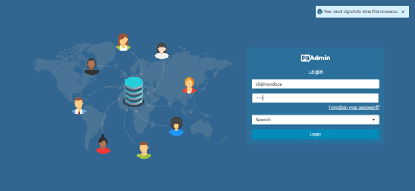
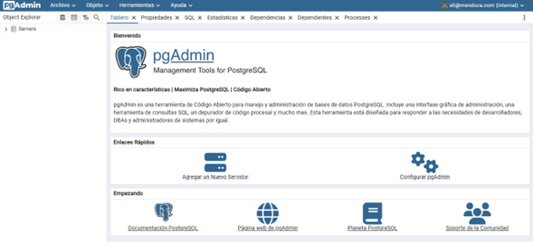
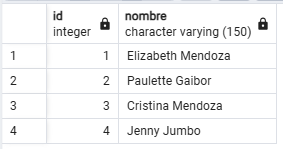
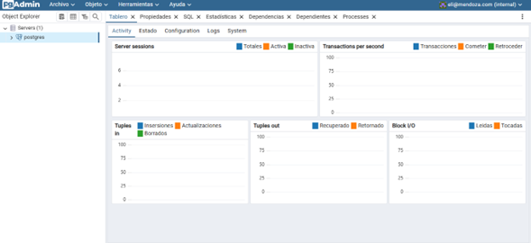
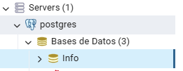
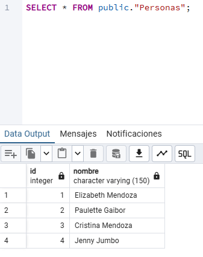

### Crear contenedor de Postgres sin que exponga los puertos. Usar la imagen: postgres:11.21-alpine3.17

```
docker run -d --name postgres --env-file="C:\Users\User\Downloads\postgres.env" postgres:11.21-alpine3.17
```

### Crear un cliente de postgres. Usar la imagen: dpage/pgadmin4

```
docker run -d --name cliente -p 80:80 -e PGADMIN_DEFAULT_EMAIL=admin@admin.com -e PGADMIN_DEFAULT_PASSWORD=admin dpage/pgadmin4
```

La figura presenta el esquema creado en donde los puertos son:
- **a:** 80
- **b:** 5432
- **c:** 80


## Desde el cliente




### Crear la base de datos info, y dentro de esa base la tabla personas, con id (serial) y nombre (varchar), agregar un par de registros en la tabla, obligatorio incluir su nombre.


## Desde el servidor postgresl


### Base de datos info


### Realizar un select *from personas

