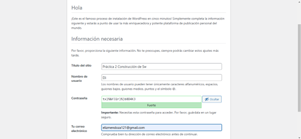
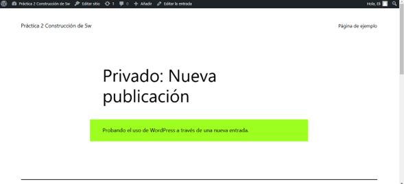
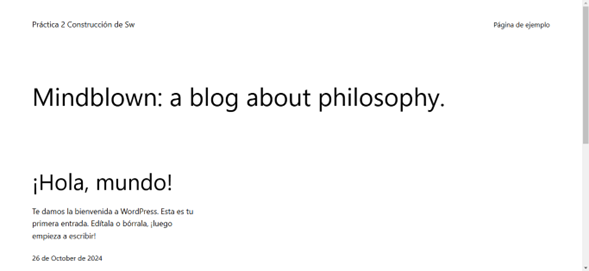

## Esquema para el ejercicio


### Crear la red
```
docker network create net-wp
```

### Crear el contenedor mysql a partir de la imagen mysql:8, configurar las variables de entorno necesarias
```
docker run -d --name mysql_server --network net-wp -e MYSQL_ROOT_PASSWORD=root -e MYSQL_DATABASE=wordpress_db -e MYSQL_USER=eliz -e MYSQL_PASSWORD=1234 mysql:8
```

### Crear el contenedor wordpress a partir de la imagen: wordpress, configurar las variables de entorno necesarias
```
docker run -d --name wordpress_srv --network net-wp -p 9300:80 -e WORDPRESS_DB_HOST=mysql_server:3306 -e WORDPRESS_DB_USER=eliz -e WORDPRESS_DB_PASSWORD=1234 -e WORDPRESS_DB_NAME=wordpress_db wordpress:latest
```

De acuerdo con el trabajo realizado, en el esquema del ejercicio el puerto a es **9300**

Ingresar desde el navegador al wordpress y finalizar la configuración de instalación.


Desde el panel de admin: cambiar el tema y crear una nueva publicación.
Recordar que a es el puerto que usó para el mapeo con wordpress.
Ingresar a: http://localhost:9300/ 


### Eliminar el contenedor wordpress
```
docker rm -f wordpress_srv
```

### Crear nuevamente el contenedor wordpress
Ingresar a: http://localhost:9300/ 
Recordar que a es el puerto que usó para el mapeo con wordpress.


### ¿Qué ha sucedido, qué puede observar?
Se observa la página de Wordpress sin ninguna entrada que se había creado previamente, los datos no persisten, ya que, al eliminar el contenedor también se eliminan estos.
